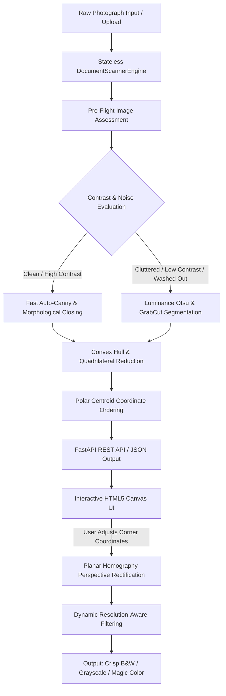

# Smart Document Scanner

[](https://www.python.org/downloads/)
[](https://fastapi.tiangolo.com)
[](https://opencv.org/)
[](https://opensource.org/licenses/MIT)

A production-ready computer vision pipeline and interactive web application that automatically detects document boundaries from raw photographs, performs planar homography perspective rectification, and applies dynamic resolution-aware adaptive thresholding.

> **Project Origin & Gen AI Refactoring Notice:**  
> This project is a complete, ground-up refactoring of an earlier experimental prototype (`smart-document-scanner`), re-engineered in pair programming with Generative AI (Google DeepMind Antigravity) to elevate the codebase from an exploratory script into a production-grade architecture adhering to clean architecture principles, rigorous mathematical invariants, comprehensive test coverage, and modern full-stack engineering standards.

---

## Table of Contents

- [System Architecture](#system-architecture)
- [Algorithmic & Mathematical Foundations](#algorithmic--mathematical-foundations)
  - [1. Polar Angle Centroid Ordering](#1-polar-angle-centroid-ordering)
  - [2. Dynamic Resolution-Aware Adaptive Filtering](#2-dynamic-resolution-aware-adaptive-filtering)
  - [3. Pre-Flight Complexity Assessment & Strategic Fallbacks](#3-pre-flight-complexity-assessment--strategic-fallbacks)
- [Repository Structure](#repository-structure)
- [Installation & Quickstart](#installation--quickstart)
- [Web Application & Interactive UI](#web-application--interactive-ui)
- [REST API Specifications](#rest-api-specifications)
- [Command Line Interface (CLI)](#command-line-interface-cli)
- [Programmatic Python Usage](#programmatic-python-usage)
- [Testing & Quality Assurance](#testing--quality-assurance)
- [License & Author](#license--author)

---

## System Architecture

The application strictly separates computational image processing from the transport layer (FastAPI) and presentation layer (HTML5 Canvas UI), following Clean Architecture:



---

## Algorithmic & Mathematical Foundations

### 1. Polar Angle Centroid Ordering

Many hobbyist implementations rely on naive coordinate sum and difference heuristics (`x + y` and `y - x`) to assign top-left, top-right, bottom-right, and bottom-left points. This heuristic fails when documents are rotated at angles near 45 degrees or subject to strong trapezoidal perspective foreshortening, frequently resulting in duplicate corner assignments and degenerate homography matrices.

`docscan.geometry` implements a robust ordering invariant:
1. Calculates polygon centroid $(\bar{x}, \bar{y}) = \frac{1}{4} \sum_{i=1}^{4} (x_i, y_i)$.
2. Computes the screen-space polar angle for each vertex:
   $$\theta_i = \text{atan2}(y_i - \bar{y}, x_i - \bar{x})$$
3. Sorts all vertices strictly clockwise around the centroid.
4. Identifies the vertex closest to the top-left origin $(0, 0)$ as Top-Left ($P_{tl}$), followed cyclically in clockwise order by Top-Right ($P_{tr}$), Bottom-Right ($P_{br}$), and Bottom-Left ($P_{bl}$).

This eliminates duplicate point assignment and guarantees non-degenerate input to `cv2.getPerspectiveTransform`.

### 2. Dynamic Resolution-Aware Adaptive Filtering

Standard thresholding with a fixed block size (e.g., $21 \times 21$ pixels) produces severe artifacts when applied across variable camera resolutions. On a 12 to 48 megapixel smartphone photograph, a 21-pixel window is narrower than a single character stroke, producing hollow letter outlines and pepper noise.

`docscan.filters` dynamically scales the local neighborhood filter window relative to the physical image dimensions:
$$\text{BlockSize} = \max\left(\text{min\_size}, \left\lfloor \max(W, H) \times \text{ratio} \right\rfloor\right) \lor 1$$

Where the bitwise OR ($\lor 1$) guarantees an odd integer neighborhood. A subtle median pre-filter is applied before Gaussian adaptive thresholding to suppress paper texture and sensor grain while keeping edge transitions sharp.

### 3. Pre-Flight Complexity Assessment & Strategic Fallbacks

The engine inspects input images before allocating heavy compute:
- **Global Contrast:** Calculated via standard deviation of luminance ($\sigma_L$).
- **High-Frequency Clutter:** Measured via Canny edge pixel density over the normalized frame.

If the image is clean and high-contrast, execution routes to the lightweight `Fast Edge Detector` ($\mathcal{O}(N)$ Canny + morphological closing). If contrast is below threshold or background clutter is high, execution automatically routes to `Fallback Segmentation` (Otsu luminance thresholding and GrabCut with an enforced 4% margin ensuring definite background seeds).

---

## Repository Structure

```text
smart-document-scanner/
├── pyproject.toml               # PEP 621 metadata, dependencies & tool configs
├── .gitignore                   # Production exclusion rules (no binaries in VCS)
├── README.md                    # Technical documentation and architecture guide
├── src/
│   └── docscan/                 # Core computer vision engine
│       ├── __init__.py          # Public library API exports
│       ├── config.py            # Dataclasses and configurable hyperparameters
│       ├── exceptions.py        # Domain-specific typed exceptions
│       ├── geometry.py          # Coordinate ordering, hull reduction, homography
│       ├── detector.py          # Auto-Canny & Otsu/Grabcut fallback strategies
│       ├── filters.py           # Resolution-aware adaptive thresholding
│       ├── pipeline.py          # Stateless orchestration engine
│       └── cli.py               # Production CLI interface (argparse + logging)
├── api/                         # Backend service layer
│   ├── __init__.py
│   ├── schemas.py               # Pydantic request and response schemas
│   └── main.py                  # FastAPI application with CORS and static serving
├── web/                         # Frontend client
│   ├── index.html               # Semantic layout with dropzone and canvas stage
│   ├── style.css                # Obsidian glassmorphic design system
│   └── app.js                   # Interactive quad editor and precision loupe
└── tests/                       # Automated test suite
    ├── __init__.py
    ├── test_geometry.py         # Point sorting, rotation invariants, homography
    ├── test_pipeline.py         # Synthetic document end-to-end integration tests
    └── test_api.py              # FastAPI endpoint tests via TestClient
```

---

## Installation & Quickstart

### Prerequisites
- Python 3.10 or higher
- Git

### Setup
```bash
# Clone the repository
git clone https://github.com/hamza-jpg/Smart-document-scanner.git
cd Smart-document-scanner

# Install package in editable development mode
pip install -e .

# Or install with development and testing dependencies
pip install -e ".[dev]"
```

---

## Web Application & Interactive UI

To launch the web interface and API server:
```bash
python -m api.main
# Or: uvicorn api.main:app --host 127.0.0.1 --port 8000 --reload
```

Navigate to `http://127.0.0.1:8000` in your web browser:

1. **Drag-and-Drop Staging:** Drop any raw photograph or select via file browser.
2. **Interactive Quad Editor:** The backend automatically identifies document boundaries and plots 4 draggable control handles on an HTML5 canvas.
3. **Precision Loupe Magnifier:** When dragging any corner handle, a real-time $2.2\times$ zoom lens with crosshairs appears above your pointer to allow sub-pixel alignment along document corners.
4. **Enhancement Filters:**
   - **Crisp B&W:** High-contrast, clean document scan using dynamic adaptive thresholding.
   - **Magic Color:** Luminance stretching in LAB color space; clears gray backgrounds while retaining colored stamps and signatures.
   - **Grayscale:** Smooth gray gradient scan.
   - **Original Color:** Perspective-flattened photograph without color modification.
5. **High-Resolution Export:** Instant preview and one-click download for production-quality JPEG or PNG scans.

---

## REST API Specifications

The FastAPI server provides automated OpenAPI/Swagger documentation at `http://127.0.0.1:8000/docs`.

### Endpoints

#### 1. System Health
```http
GET /api/health
```
**Response:**
```json
{
  "status": "ok",
  "version": "0.1.0",
  "service": "smart-document-scanner-api"
}
```

#### 2. Detect Document Boundaries
```http
POST /api/detect
Content-Type: multipart/form-data
```
**Form Parameter:** `file` (Binary image file)

**Response:**
```json
{
  "status": "success",
  "corners": [
    [152.0, 84.0],
    [980.0, 112.0],
    [945.0, 1260.0],
    [120.0, 1210.0]
  ],
  "image_width": 1100,
  "image_height": 1400,
  "algorithm": "fast_edge"
}
```

#### 3. Rectify & Process Document
```http
POST /api/process
Content-Type: multipart/form-data
```
**Form Parameters:**
- `file`: Binary image file (Required)
- `corners`: JSON string of 4 coordinates `[[x1,y1],[x2,y2],[x3,y3],[x4,y4]]` (Optional; auto-detected if omitted)
- `filter_mode`: `bw`, `color_enhanced`, `grayscale`, or `original` (Default: `bw`)
- `output_format`: `jpg` or `png` (Default: `jpg`)

**Response:** Binary image stream (`image/jpeg` or `image/png`) with headers:
- `Content-Disposition: inline; filename="scan.jpg"`
- `X-Detection-Algorithm: user_provided`
- `X-Processed-Width: 850`
- `X-Processed-Height: 1180`

---

## Command Line Interface (CLI)

The CLI tool enables batch and automated scripting workflows:

```bash
# Standard scan with default Crisp B&W filter
python -m docscan.cli --input path/to/document.jpg --output scanned_doc.jpg

# Color-enhanced scan for contracts with stamps
python -m docscan.cli --input invoice.png --output invoice_clean.jpg --mode color_enhanced

# Debug mode displaying intermediate CV detection steps
python -m docscan.cli --input sample.jpg --output output.jpg --debug
```

### CLI Arguments
- `-i, --input`: Path to input document photograph (Required).
- `-o, --output`: Path where processed image will be written (Default: `scanned_output.jpg`).
- `-m, --mode`: Enhancement filter (`bw`, `grayscale`, `color_enhanced`, `original`).
- `--debug`: Renders interactive OpenCV preview windows of intermediate steps.

---

## Programmatic Python Usage

The `docscan` library can be imported directly into Python applications, microservices, or data processing pipelines:

```python
from docscan import DocumentScannerEngine, FilterMode, ScanConfig

# Initialize engine with custom or default configuration
engine = DocumentScannerEngine(ScanConfig(min_area_ratio=0.05))

# Read image into memory (from file path or raw bytes)
image = engine.load_from_path("photo.jpg")

# 1. Step-by-step modular usage
corners, algorithm = engine.detect_corners(image)
warped = engine.warp_document(image, corners)
enhanced = engine.apply_enhancement(warped, mode=FilterMode.BW)

# 2. Or end-to-end atomic scan
result = engine.scan(image, mode=FilterMode.COLOR_ENHANCED)

# Save output
engine.encode_image(result.enhanced, extension=".jpg")
```

---

## Testing & Quality Assurance

The project includes an automated test suite verifying mathematical invariants, convex hull reductions, and API endpoint contracts:

```bash
pytest -v
```

### Test Coverage Highlights
- `test_order_points_standard_rectangle`: Confirms Top-Left, Top-Right, Bottom-Right, Bottom-Left ordering invariant on unordered inputs.
- `test_order_points_rotated`: Verifies rotation stability for skewed polygons without point duplication.
- `test_simplify_to_quadrilateral_from_polygon`: Tests simplification of arbitrary 8+ point polygons (e.g., spiral notebook edges) into valid 4-corner hulls.
- `test_warp_perspective`: Confirms homography transformation accuracy and destination dimension scaling.
- `test_pipeline_detection_and_scan`: End-to-end integration test over procedurally generated synthetic document scenes.
- `test_api_endpoints`: Validates `/api/health`, `/api/detect`, `/api/process`, and static web serving via FastAPI's `TestClient`.

---

## License & Author

- **Author:** Hamza Ogretmis ([hamzaogretmis@gmail.com](mailto:hamzaogretmis@gmail.com))
- **License:** MIT License. See [LICENSE](LICENSE) for details.
