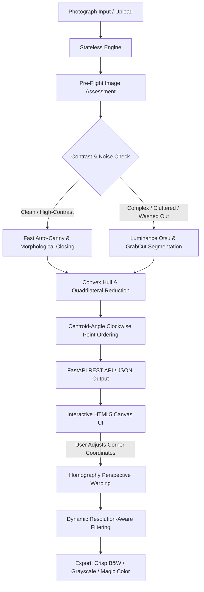

# Smart Document Scanner

[](https://www.python.org/downloads/)
[](https://fastapi.tiangolo.com)
[](https://opencv.org/)
[](https://opensource.org/licenses/MIT)

A production-grade computer vision pipeline and interactive web application that automatically detects document boundaries from photographs, performs homography perspective rectification, and applies resolution-aware adaptive thresholding.

---

## 🏛 Architecture & Engineering Design

This project decouples the **computational computer vision core** from the **API** and **User Interface**, following Clean Architecture principles:



### 1. Robust Centroid-Angle Corner Ordering
Unlike naive sum/diff corner ordering that breaks when documents are rotated or perspective-skewed, `docscan.geometry` sorts 4 coordinates using **polar angles relative to the polygon centroid** before assigning Top-Left, Top-Right, Bottom-Right, and Bottom-Left.

### 2. Resolution-Aware Adaptive Filtering
Fixed-kernel adaptive thresholding degrades high-resolution camera photos (e.g. 12MP-48MP). The filter module dynamically computes local neighborhood block sizes proportional to the physical pixel dimensions:
$$\text{BlockSize} = \max\left(\text{min\_size}, \lfloor \max(W, H) \times \text{ratio} \rfloor\right) \lor 1$$

### 3. CamScanner-Style Interactive Web Interface
Automated computer vision can occasionally fail on extreme backgrounds. The web client provides an interactive HTML5 Canvas with **real-time draggable corner handles** and a **precision 2.5x magnifier loupe**, allowing users to fine-tune boundaries before rectification.

---

## 🚀 Getting Started

### Prerequisites
* Python 3.10 or higher
* Modern web browser (Chrome, Edge, Firefox, Safari)

### Installation
```bash
# Clone the repository
git clone https://github.com/hamza-jpg/Smart-document-scanner.git
cd Smart-document-scanner

# Install dependencies in editable mode
pip install -e .
```

---

## 💻 Usage

### 1. Web Application & REST API
Start the FastAPI server:
```bash
python -m api.main
# Or: uvicorn api.main:app --reload --host 0.0.0.0 --port 8000
```
Open [http://localhost:8000](http://localhost:8000) in your browser:
* **Interactive UI:** Upload photos, inspect pre-flight telemetry, drag corner points, toggle filter modes, and download high-resolution scans.
* **OpenAPI Documentation:** Interactive Swagger UI is available at [http://localhost:8000/docs](http://localhost:8000/docs).

### 2. Command Line Interface (CLI)
Process documents directly from the terminal without launching the web server:
```bash
# Basic scan with default Crisp B&W
python -m docscan.cli --input photo.jpg --output scan.jpg

# Custom filter mode (bw, grayscale, color_enhanced, original)
python -m docscan.cli --input invoice.png --output invoice_clean.jpg --mode color_enhanced

# Debug mode with OpenCV step visualization
python -m docscan.cli --input document.jpg --output output.jpg --debug
```

### 3. Python Library Usage
```python
from docscan import DocumentScannerEngine, FilterMode

engine = DocumentScannerEngine()

# Read from file or bytes
image = engine.load_from_path("document.jpg")

# Detect, warp, and filter in one call
result = engine.scan(image, mode=FilterMode.BW)

# Save or access array directly
# result.enhanced is a NumPy array
```

---

## 🧪 Testing

Run the automated test suite covering geometric transformations, corner ordering invariants, and end-to-end scanning:
```bash
pytest -v
```

---

## 📁 Repository Structure

```text
smart-document-scanner/
├── pyproject.toml               # PEP 621 package metadata & dependencies
├── .gitignore                   # Production git exclusion patterns
├── README.md                    # Technical documentation
├── src/
│   └── docscan/                 # Core computer vision engine
│       ├── __init__.py          # Public API exports
│       ├── config.py            # Dataclasses and hyperparameters
│       ├── exceptions.py        # Domain-specific exceptions
│       ├── geometry.py          # Coordinate ordering and homography transforms
│       ├── detector.py          # Auto-Canny & GrabCut/Otsu fallback strategies
│       ├── filters.py           # Resolution-aware adaptive thresholding
│       ├── pipeline.py          # Stateless orchestration engine
│       └── cli.py               # Command-line interface
├── api/                         # Web service layer
│   ├── __init__.py
│   ├── schemas.py               # Pydantic request/response schemas
│   └── main.py                  # FastAPI endpoints & static web serving
├── web/                         # Interactive frontend
│   ├── index.html               # Semantic HTML5 layout
│   ├── style.css                # Obsidian glassmorphic design system
│   └── app.js                   # Interactive canvas & loupe magnifier
└── tests/                       # Automated test suite
    ├── __init__.py
    ├── test_geometry.py         # Point sorting & homography tests
    └── test_pipeline.py         # End-to-end synthetic scan tests
```

---

## 📄 License
This project is licensed under the MIT License.
